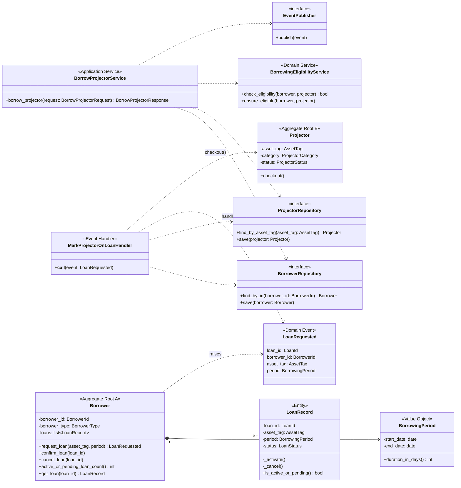
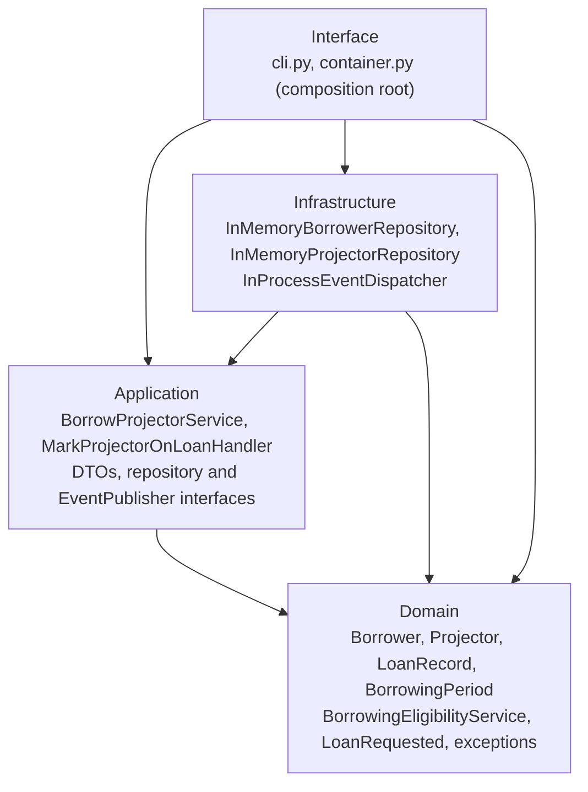
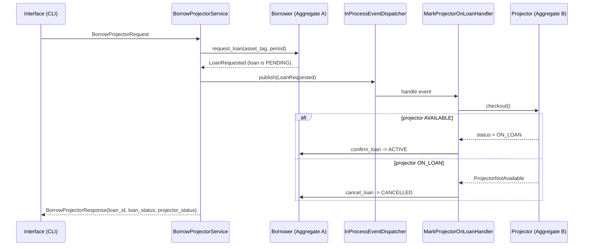

# Diagrams

These diagrams match the source code. Use them for slides 5, 8 and 10.

## Class diagram

Value objects for identity: `BorrowerId`, `LoanId`, `AssetTag` (all share the `Identifier` base).
Enums: `BorrowerType` (STUDENT, STAFF), `LoanStatus` (PENDING, ACTIVE, CANCELLED),
`ProjectorCategory` (STANDARD, PREMIUM), `ProjectorStatus` (AVAILABLE, ON_LOAN).

## Clean Architecture dependencies

Arrows point from the importing layer to the imported layer. Nothing points outward.

## BR5 event flow

